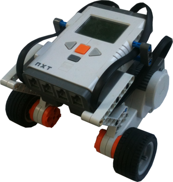

# lejos-remote-control
lejos-remote-control allows remote control of a two wheeled Lego Mindstorm robot, using arrow keys on linux. It is compiled using the [Lejos nxj framework](http://www.lejos.org/nxj.php) and firmware (v0.9.1).

<p align="center">

</p>

The project is divided in two parts that communicate with each other, an Initiator and a Receiver.

###Initiator
The Initiator class runs on the computer.
It initalizes a connection to the robot via bluetooth, and feeds it with keycodes after key presses. The arrow keys control the rebot movement, the ESC key closes both applications.

**Compile with:** 

```nxjpcc Initiator.java RepeatingReleasedEventsFixer.java```

**Run with:** 

```nxjpc Initiator```

*Note:* the robot reciever class needs to be running before this class is ran.
  
###Receiver
The Reciever class runs on the robot.
It waits for a connection to be established via bluetooth, then moves the motor according to the keycodes sent by the initiator.

**Compile with:** 

```nxjc Reciever.java```

**Run with:** 

```nxj -r -o Reciever.nxj Reciever```

*Note:* the robot reciever class needs to be running first.

##Useful links
* [Pairing the NXT robot on linux](http://www.eggwall.com/2011/07/setting-up-nxt-bluetooth-support-on.html)
* [The Lejos NXJ Tutorial](http://www.lejos.org/nxt/nxj/tutorial/index.htm)
* [Fix for Java repeated RELEASED KeyEvents on linux](http://tech.stolsvik.com/2010/05/linux-java-repeats-released-keyevents.html)
